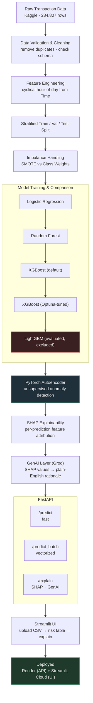

# SentinelML — Fraud Detection & Explainability Platform


An end-to-end machine learning system that detects credit card fraud, explains *why* each transaction was flagged, and translates that explanation into plain English — combining classical ML, deep learning, explainable AI (XAI), and a GenAI reasoning layer.

**Live Demo:** [sentinelml-fraud-detection.streamlit.app](https://sentinelml-fraud-detection.streamlit.app)
**API:** [sentinelml-7prh.onrender.com](https://sentinelml-7prh.onrender.com)
**Repo:** [github.com/Debasish65368/sentinelml](https://github.com/Debasish65368/sentinelml)

> Note: the API runs on Render's free tier, which sleeps after inactivity. The first request after idle time may take 30–50 seconds to wake up.

---

## Demo

**Prediction results — batch scoring with risk-sorted, color-coded output:**


**Explanation view — SHAP breakdown + GenAI-generated rationale:**


---

## Why this project exists

Most "fraud detection" student projects stop at "trained XGBoost, got 98% accuracy." That number is meaningless here — fraud is 0.17% of transactions, so a model that predicts "not fraud" every time would already be 99.8% "accurate" while catching zero fraud.

This project instead focuses on what real fraud systems need:
- Handling extreme class imbalance correctly
- Comparing multiple models with the right metrics (not just accuracy)
- Testing whether deep learning genuinely adds value, and reporting honestly when it doesn't
- Making every prediction explainable, not a black box
- Serving and deploying it as a real, working system — not just a notebook

---

## Architecture



---

## Dataset

| Property | Value |
|---|---|
| Total transactions | 284,807 |
| Fraud transactions | 492 (0.173%) |
| Normal : Fraud ratio | ~578 : 1 |
| Features | 28 anonymized PCA components (V1–V28) + Amount + Time |
| Duplicate rows found & removed | 1,081 |
| Source | [Kaggle — Credit Card Fraud Detection](https://www.kaggle.com/mlg-ulb/creditcardfraud) |

---

## Model Comparison

All models trained on the same stratified split, evaluated on a held-out validation set. **PR-AUC** (Precision-Recall AUC) is used as the primary metric, not accuracy or ROC-AUC alone, since it's the standard for extreme class imbalance.

| Model | ROC-AUC | PR-AUC | Precision | Recall | F1 | Inference Time |
|---|---|---|---|---|---|---|
| **XGBoost (tuned)** ✅ | **0.9828** | **0.8779** | 0.922 | 0.831 | 0.874 | 0.094s |
| LightGBM (fixed) | 0.9566 | 0.8599 | 0.824 | 0.859 | 0.841 | 0.219s |
| Random Forest | 0.9605 | 0.8588 | 0.908 | 0.831 | 0.868 | 0.116s |
| XGBoost (default) | 0.9800 | 0.8499 | 0.642 | 0.859 | 0.735 | 0.058s |
| Logistic Regression (baseline) | 0.9741 | 0.7214 | 0.057 | 0.901 | 0.107 | 0.004s |

**Winner: Tuned XGBoost** (Optuna, 30 trials, optimizing PR-AUC). Selected for best PR-AUC and inference time under the 100ms latency target.

LightGBM was evaluated but excluded — despite a promising fix during debugging (see below), its final PR-AUC and latency didn't beat XGBoost.

---

## Deep Learning: Autoencoder vs Supervised Model

A PyTorch autoencoder was trained **only on normal transactions** to detect fraud via reconstruction error — a genuinely different, unsupervised approach compared to XGBoost's supervised learning.

| Comparison | Result |
|---|---|
| Fraud cases caught by both | 21 |
| Caught only by autoencoder | 0 |
| Caught only by XGBoost (tuned) | 38 |
| Missed by both | 12 |

**Finding:** The autoencoder added zero incremental fraud detection value over supervised XGBoost on this dataset. This is expected, not a failure — autoencoders shine when labeled fraud data is scarce or unavailable. Here, XGBoost had direct access to 473 labeled fraud examples, giving it a stronger, more targeted signal than reconstruction-error-based anomaly detection could provide. This result demonstrates *when* unsupervised anomaly detection is and isn't the right tool.

---

## Explainability (SHAP)

Every prediction can be broken down into per-feature contributions using SHAP (SHapley Additive exPlanations), based on Shapley values from cooperative game theory.

**Top features driving predictions:** V14, V4, V12, V10, V11, V26, V3, V8, Amount, V7

8 of the top 10 features identified by simple EDA correlation also appear in SHAP's top 15 — confirming the model's reasoning aligns with real statistical signal, not spurious patterns. SHAP also surfaces nonlinear/interaction effects (like `V26`, `Amount`) that simple correlation misses.

Example — a confidently-flagged fraud case (risk = 0.999998):

| Feature | Value | Contribution | Direction |
|---|---|---|---|
| V14 | -7.463 | 4.71 | raises risk |
| V10 | -6.541 | 2.28 | raises risk |
| V12 | -4.938 | 2.01 | raises risk |
| V4 | 3.533 | 1.25 | raises risk |
| V3 | -7.617 | 0.80 | raises risk |

*(All top features agree in direction here because the prediction is extremely confident — near-certain fraud has overwhelming, one-directional evidence. Borderline predictions show a genuine mix of raising/lowering factors.)*

---

## GenAI Explanation Layer

SHAP output alone is a table of numbers — not useful to a non-technical fraud analyst. This project adds a lightweight GenAI layer (Groq, `llama-3.3-70b-versatile`) that converts SHAP contributions into a short, plain-English rationale.

**Example output:**
> "This transaction has a very high predicted probability of being fraudulent. The values of V14, V10, and V12 are particularly noteworthy, as they have significantly raised the model's suspicion of fraud, along with V4 and V3, which also contribute to the elevated risk."

The explanation is **grounded in real SHAP values** (passed directly into the prompt) rather than generic LLM knowledge about fraud — this reduces hallucination risk and keeps every explanation traceable to the model's actual reasoning. A basic automated check confirms each explanation references the true top SHAP-driving features.

---

## Tech Stack

| Layer | Technology | Purpose |
|---|---|---|
| Data handling | Pandas, NumPy | Cleaning, feature engineering |
| Classical ML | Scikit-learn, XGBoost, LightGBM | Model training & comparison |
| Imbalance handling | imbalanced-learn (SMOTE) | Class imbalance correction |
| Hyperparameter tuning | Optuna | Automated XGBoost tuning (30 trials) |
| Deep learning | PyTorch | Autoencoder for anomaly detection |
| Explainability | SHAP | Per-prediction feature attribution |
| GenAI | Groq API | Plain-English explanation generation |
| Experiment tracking | MLflow | Logging params, metrics, artifacts across all runs |
| Backend API | FastAPI, Uvicorn | Model serving (`/predict`, `/predict_batch`, `/explain`) |
| Frontend | Streamlit | Interactive demo UI |
| Deployment | Render (API), Streamlit Community Cloud (UI) | Public hosting |

---

## API Endpoints

| Endpoint | Method | Purpose |
|---|---|---|
| `/health` | GET | Service status check |
| `/predict` | POST | Fast single-transaction risk score (no explanation) |
| `/predict_batch` | POST | Vectorized batch scoring — scores hundreds of transactions in one call instead of one-by-one |
| `/explain` | POST | Full SHAP breakdown + GenAI explanation for one transaction |

`/predict` and `/explain` are intentionally separate: prediction needs to be fast (used for bulk scoring), while explanation involves SHAP computation and an external LLM call — only triggered on demand when an analyst inspects a specific transaction.

---

## Local Setup

```bash
# Create and activate virtual environment
python -m venv venv
.\venv\Scripts\Activate.ps1

# Install dependencies
python -m pip install --upgrade pip
python -m pip install -r requirements.txt
```

Add your Groq API key to a local `.env` file:

GROQ_API_KEY=your_key_here


Place the Kaggle dataset at `data/raw/creditcard.csv`.

**Run the API:**
```bash
.\venv\Scripts\uvicorn.exe api.main:app --reload
```
Health check: `http://localhost:8000/health`

**Run the Streamlit demo** (in a second terminal):
```powershell
$env:SENTINELML_API_BASE_URL="http://localhost:8000"
.\venv\Scripts\streamlit.exe run streamlit_app\app.py
```

---

## Deployment Notes

- **Render:** start command `uvicorn api.main:app --host 0.0.0.0 --port $PORT`. Requires `GROQ_API_KEY` set as an environment variable in the Render dashboard.
- **Streamlit Community Cloud:** app entrypoint `streamlit_app/app.py`. Requires `SENTINELML_API_BASE_URL` set to the deployed Render URL.
- **`models/tuned_xgboost.json`** is committed to the repo (small artifact, ~1.5MB) since the API needs it available at startup in a fresh deployment — training data and MLflow logs stay gitignored.

---

## Project Structure

```
sentinelml/
├── api/                  FastAPI app (main.py, schemas.py)
├── src/                  Core pipeline logic (data, features, training, autoencoder, explain)
├── streamlit_app/        Demo UI
├── notebooks/            EDA and interactive result viewing (calls into src/)
├── experiments/          Per-experiment findings and decisions (experiment_00 → 09)
├── tests/                Pytest suite covering pipeline, models, API
├── models/                Trained model artifact (tuned_xgboost.json)
├── mlruns/                MLflow experiment tracking (local)
├── DESIGN_DECISIONS.md    One-line rationale for every major architecture choice
└── requirements.txt
```


Each `experiments/experiment_NN.md` documents what was tried, why, the result, and the decision made — a full reasoning trail from raw data to deployed system.

---

## Key Engineering Decisions

- **class_weight over SMOTE** — higher PR-AUC (0.721 vs 0.710), avoids synthetic-data artifacts
- **Stratified random split, not time-based** — dataset only spans ~2 days, too short for a meaningful chronological holdout
- **LightGBM evaluated and excluded** — a saturated-probability bug was found and fixed during evaluation (see `experiments/experiment_04_lightgbm.md`), but corrected performance still didn't beat tuned XGBoost
- **`/predict` and `/explain` split** — different latency/cost profiles; SHAP + LLM calls only run on demand
- **No cloud (AWS/GCP)** — deliberate scope decision; Render/Streamlit Cloud kept deployment complexity proportional to project timeline

Full rationale for every decision is in [`DESIGN_DECISIONS.md`](./DESIGN_DECISIONS.md).

---

