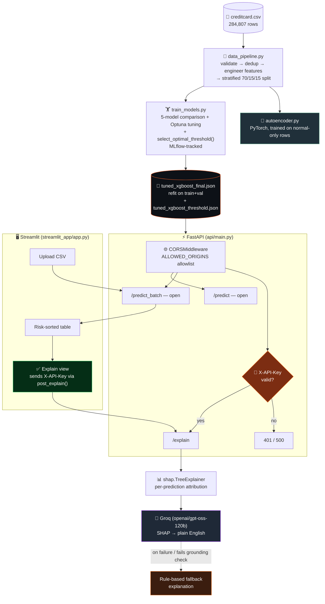
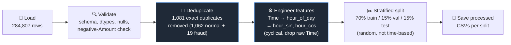
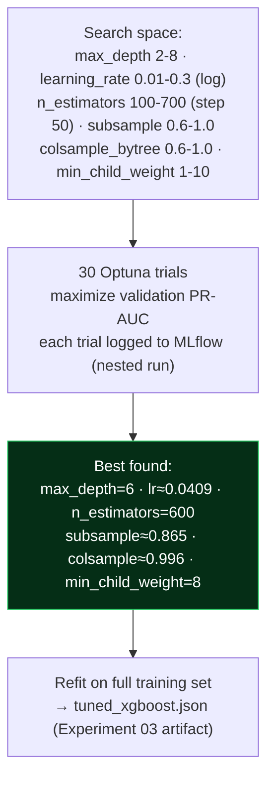
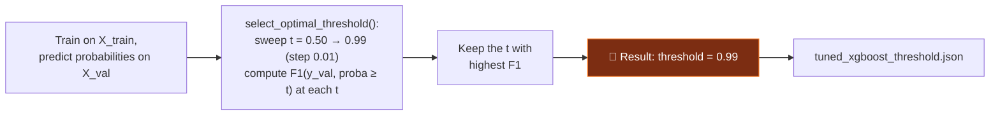
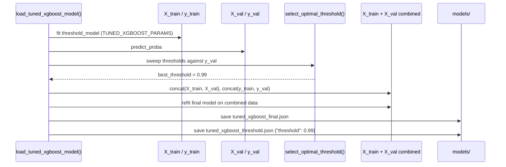
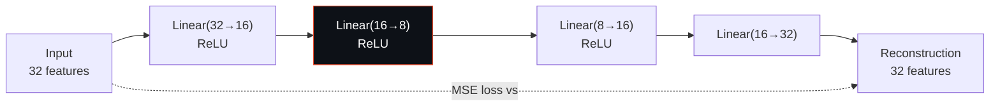
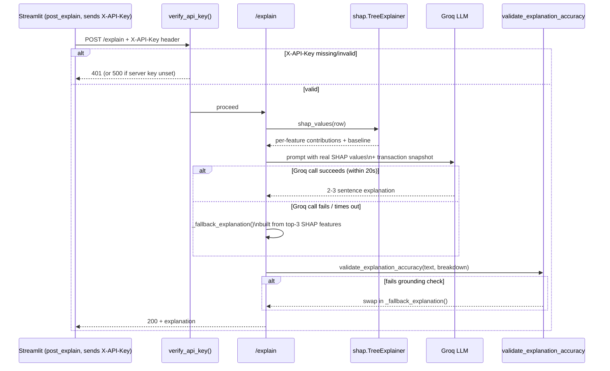
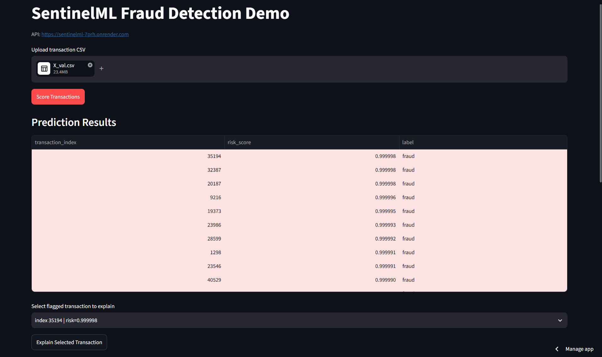
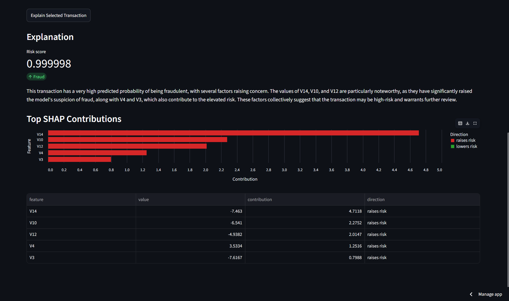

<div align="center">

# 🛡️ SentinelML — Fraud Detection & Explainability Platform

### An end-to-end ML system that catches credit-card fraud, explains *why* in SHAP values, translates that into plain English, and serves it all behind a hardened, key-gated API.


**284,807 transactions · 0.173% fraud rate (≈578 : 1) · 5 models compared · 41 automated tests · API-key-gated GenAI endpoint**

**Live Demo:** [sentinelml-fraud-detection.streamlit.app](https://sentinelml-fraud-detection.streamlit.app) · **API:** [sentinelml-7prh.onrender.com](https://sentinelml-7prh.onrender.com)

*The API runs on Render's free tier and sleeps after inactivity — the first request after idle time may take 30–50s to wake up.*

</div>

---

## 📖 Table of Contents

- [Why This Project Exists](#-why-this-project-exists)
- [Architecture](#-architecture)
- [Data Pipeline](#-data-pipeline)
- [Model Training & Comparison](#-model-training--comparison)
- [Hyperparameter Tuning](#-hyperparameter-tuning-optuna)
- [The LightGBM Bug](#-the-lightgbm-bug)
- [Decision Threshold — Not a Flat 0.5](#-decision-threshold--not-a-flat-05)
- [Final Model: Refit on Train + Validation](#-final-model-refit-on-train--validation)
- [Deep Learning: Autoencoder vs Supervised Model](#-deep-learning-autoencoder-vs-supervised-model)
- [Explainability (SHAP)](#-explainability-shap)
- [GenAI Explanation Layer](#-genai-explanation-layer)
- [API Security](#-api-security)
- [API Reference](#-api-reference)
- [Testing](#-testing)
- [Screenshots](#-screenshots)
- [Local Setup](#-local-setup)
- [Deployment](#-deployment)
- [Project Structure](#-project-structure)
- [Tech Stack](#-tech-stack)

---

## 🎯 Why This Project Exists

Most "fraud detection" student projects stop at "trained XGBoost, got 98% accuracy." That number is meaningless here — fraud is **0.173% of transactions**, so a model that predicts "not fraud" every single time would already be 99.8% "accurate" while catching zero fraud.

This project instead focuses on what real fraud systems actually need:

- Handling extreme class imbalance correctly (class weighting, tested head-to-head against SMOTE)
- Comparing multiple models with the *right* metric — PR-AUC, not accuracy or ROC-AUC alone
- Testing whether deep learning genuinely adds value — and reporting honestly when it doesn't
- Making every prediction explainable with SHAP, not a black box
- Choosing a decision threshold deliberately by sweeping F1, not defaulting to 0.5
- Serving it behind a CORS allowlist and a constant-time API-key check, not a wide-open demo endpoint

---

## 🏗️ Architecture



`/predict` and `/explain` are deliberately separate: prediction is fast and open, for bulk scoring, while explanation runs a SHAP computation *and* a billed external LLM call — which is exactly why `/explain` is the one endpoint gated behind an API key, checked via `secrets.compare_digest()` in `verify_api_key()`. The Streamlit client (`streamlit_app/_explain_client.py`) resolves that key from Streamlit secrets or the environment and attaches it as an `X-API-Key` header on every `/explain` call through `post_explain()` — a dedicated regression test (`test_post_explain_sends_api_key_header`) locks this behavior in.

---

## 🔄 Data Pipeline



**Why a random split instead of chronological?** The dataset spans only ~2 days (`Time` runs 0 → 172,792 seconds) — too short a window for a meaningful time-based holdout, so a stratified random split (preserving the fraud ratio in every split) is the more honest choice. After dedup, 473 of the original 492 fraud rows remain, and the ~0.167% fraud rate holds consistently across train (331 fraud / 198,608 rows), validation (71 fraud / 42,559 rows), and test (71 fraud / 42,559 rows).

**Why cyclical hour features?** Raw `Time` (seconds elapsed) has a hard discontinuity at midnight — hour 23 and hour 0 are adjacent in reality but numerically far apart. `hour_sin`/`hour_cos` encode time-of-day on a circle, so the model sees hour 23 and hour 0 as neighbors, the way fraud patterns actually cluster by time of day.

---

## 🏆 Model Training & Comparison

All 5 models trained on the same stratified split, evaluated on the held-out validation set. **PR-AUC** (Precision-Recall AUC) is the primary metric — not accuracy or ROC-AUC alone — since it's the standard for extreme class imbalance.

| Model | ROC-AUC | PR-AUC | Precision | Recall | F1 | Inference Time |
|---|---|---|---|---|---|---|
| **XGBoost (tuned)** ✅ | **0.9828** | **0.8779** | 0.922 | 0.831 | 0.874 | 0.094s |
| LightGBM (fixed) | 0.9566 | 0.8599 | 0.824 | 0.859 | 0.841 | 0.219s |
| Random Forest | 0.9605 | 0.8588 | 0.908 | 0.831 | 0.868 | 0.116s |
| XGBoost (default) | 0.9800 | 0.8499 | 0.642 | 0.859 | 0.735 | 0.058s |
| Logistic Regression (baseline) | 0.9741 | 0.7214 | 0.057 | 0.901 | 0.107 | 0.004s |

**Selected Model: Tuned XGBoost** — best PR-AUC on the validation set, and comfortably inside the sub-100ms latency budget the API is designed around (measured `/predict` latency in testing: ~6.7ms). PR-AUC improved from 0.7214 (baseline) to 0.8779 — untuned XGBoost actually *underperforms* Random Forest on PR-AUC, which shows the Optuna tuning specifically drove the improvement, not just the algorithm choice.

**Imbalance handling — `class_weight` over SMOTE:** tested head-to-head on Logistic Regression — `class_weight="balanced"` scored a higher PR-AUC (0.7214 vs 0.7096) despite SMOTE edging it out slightly on ROC-AUC and F1. Every tree model uses class weighting (`scale_pos_weight` for XGBoost, `is_unbalance` for LightGBM) rather than SMOTE, avoiding any risk of synthetic-sample artifacts.

---

## 🎯 Hyperparameter Tuning (Optuna)



Every one of the 30 trials — plus every baseline model run — is logged to **MLflow** (params, metrics, and the model artifact itself), giving a full, queryable experiment history rather than just a final number. These exact hyperparameters are hardcoded as `TUNED_XGBOOST_PARAMS` in `api/main.py`, so the API can rebuild the production model from scratch if the cached artifact is ever missing.

---

## 🐛 The LightGBM Bug

```mermaid
flowchart LR
    A["Train LightGBM\nwith XGBoost-matched\nhyperparameters"]
    B["🚩 PR-AUC = 0.096\ndrastically inconsistent\nwith its own F1 (0.21)"]
    C["🔍 Investigate:\nprobabilities are near-binary —\nonly 20 unique values"]
    D["Root cause: saturated\nprobability outputs break\nPR-AUC's ranking calculation"]
    E["🔧 Fix: is_unbalance=True\n+ min_child_weight=8"]
    F["✅ 42,409 unique probability\nvalues restored — PR-AUC\ncorrectly measurable: 0.8599"]
    G["Still excluded: doesn't beat\ntuned XGBoost on PR-AUC\nor the sub-100ms latency target"]

    A --> B --> C --> D --> E --> F --> G

    style B fill:#450a0a,color:#fff,stroke:#dc2626
    style F fill:#052e16,color:#fff,stroke:#22c55e
    style G fill:#3b1d0f,color:#fff,stroke:#f97316
```



A PR-AUC of 0.096 alongside an F1 of 0.21 doesn't add up — F1 measures one threshold, PR-AUC measures the whole ranking, and a model can't be *that* much worse at ranking than at a single cutoff unless something is broken about the ranking itself. That mismatch was the signal to dig in rather than accept the number: predicted probabilities had collapsed to near-binary output (only 20 distinct values across the validation set), starving PR-AUC of the graduated confidence scores it needs. Matching LightGBM's `min_child_weight` to XGBoost's tuned value restored a proper probability distribution — the honest result, once fixed, still didn't beat XGBoost (0.8599 vs 0.8779 PR-AUC, and 0.219s vs 0.094s inference), and it's kept in the repo specifically as a documented comparison rather than deleted or hidden.

---

## 🎚️ Decision Threshold — Not a Flat 0.5

Earlier versions of this API labeled a transaction "fraud" whenever `risk_score >= 0.5`. That's now replaced with a **threshold chosen by sweeping F1**, not assumed:



The sweep landed on **0.99** — a transaction now needs a ≥99% predicted probability to be labeled `"fraud"` by `/predict`, `/predict_batch`, and `/explain` alike (`_label_from_probability` takes the threshold as a parameter everywhere it's used, never hardcoding 0.5). This reflects that the tuned model's probability outputs are extremely well-separated — confident predictions cluster near 0 or 1 — so pushing the threshold that high still maximizes F1 on the validation set. The trade-off: a transaction scored at, say, 0.85, which most people would intuitively call "high risk," is still labeled `"normal"` under this threshold. That's a legitimate business-policy call (precision vs. recall priorities) as much as an ML one.

---

## 🔁 Final Model: Refit on Train + Validation

Threshold selection needs an untouched validation set to sweep against — but once the threshold is locked in, holding validation data back from the production model is pure waste. `load_tuned_xgboost_model()` in `api/main.py` does both, in the right order:



The **test set stays fully untouched by both steps** — threshold selection uses only `X_val`, and the final refit uses `X_train + X_val`, never `X_test`.

**Final Deployed Model Test Performance (XGBoost tuned, threshold=0.99, evaluated on `X_test`):**
- **ROC-AUC:** 0.9734
- **PR-AUC:** 0.8182
- **Precision:** 0.9808
- **Recall:** 0.7183
- **F1 Score:** 0.8293
- **Confusion Matrix:** 42,487 True Negatives, 1 False Positive, 20 False Negatives, 51 True Positives.

If no cached model is found on disk, the API trains this whole pipeline fresh at startup instead of failing.

---

## 🧠 Deep Learning: Autoencoder vs Supervised Model

A PyTorch autoencoder trained **only on normal transactions** — a genuinely different, unsupervised approach — to detect fraud via reconstruction error rather than direct classification.



Trained for 50 epochs (Adam, lr=0.001, final training loss 0.484) on `Class=0` rows only — the model never sees a single fraud example during training. At inference, the **reconstruction error** (MSE between input and output) becomes the anomaly signal: transactions the model can't reconstruct well look unfamiliar.

Three thresholding strategies were compared on the reconstruction error before picking one:

| Strategy | Threshold | Precision | Recall | F1 | PR-AUC |
|---|---|---|---|---|---|
| 95th percentile of normal errors | — | 0.029 | 0.887 | 0.056 | 0.240 |
| 99th percentile of normal errors | — | 0.113 | 0.761 | 0.196 | 0.240 |
| **F1-optimal sweep (chosen)** ✅ | **44.54** | **0.488** | **0.296** | **0.368** | **0.240** |

**Finding:** even at its best operating point, the autoencoder's PR-AUC (0.240) sits far below tuned XGBoost's (0.878). This is expected, not a failure — autoencoders shine when labeled fraud data is scarce or unavailable. Here, XGBoost had direct access to 473 labeled fraud examples during training, giving it a stronger, more targeted signal than reconstruction-error-based anomaly detection could provide on its own. The codebase includes `compare_autoencoder_vs_xgboost()` to break down exactly which fraud cases each model catches, misses, or shares — a per-case overlap study left as an open next step on top of the headline PR-AUC comparison above. The result demonstrates *when* unsupervised anomaly detection is — and isn't — the right tool, rather than assuming "add deep learning" is automatically an improvement.

---

## 🔎 Explainability (SHAP)

Every prediction can be broken down into per-feature contributions using SHAP (SHapley Additive exPlanations), computed via `shap.TreeExplainer` against the tuned XGBoost model.

**Top 15 features by mean |SHAP value|:** V14, V4, V12, V10, V11, V26, V3, V8, Amount, V7, V19, V21, V15, V18, V20

**SHAP vs. simple EDA correlation:** the top 5 features by raw correlation with `Class` were V17, V14, V12, V10, V16. 8 of the top 10 EDA-correlated features also appear in SHAP's top 15 — strong general agreement. Notably, V17 (EDA's #1 correlated feature) does *not* appear in SHAP's top 15, likely because PCA components aren't fully independent and the tree model leans on the more informative among a correlated group. SHAP also surfaces features simple correlation missed entirely (V26, V8, Amount, V19, V21) — evidence of nonlinear/interaction effects a linear correlation can't detect.

**Live example — the confidently-flagged fraud case shown in the demo screenshots (risk = 0.999998):**

| Feature | Value | Contribution | Direction |
|---|---|---|---|
| V14 | -7.463 | 4.71 | raises risk |
| V10 | -6.541 | 2.28 | raises risk |
| V12 | -4.938 | 2.01 | raises risk |
| V4 | 3.533 | 1.25 | raises risk |
| V3 | -7.617 | 0.80 | raises risk |

*(All top features agree in direction here because the prediction is extremely confident — near-certain fraud has overwhelming, one-directional evidence. Borderline predictions show a genuine mix of raising/lowering factors, as in the false-positive and false-negative case studies documented in `experiments/experiment_06_shap.md`.)*

---

## 🧠 GenAI Explanation Layer

SHAP output alone is a table of numbers representing contributions in the model's raw log-odds output space (relative to the dataset base value), rather than direct percentage-point changes in probability — not immediately intuitive to a non-technical fraud analyst. A lightweight GenAI layer (Groq, `openai/gpt-oss-120b`) converts these SHAP contributions into a short, plain-English rationale.



**Example output (true-positive case, prob 0.999821):**
> This transaction has a high predicted probability of being fraudulent... The model is particularly concerned about the values of V14 and V10, which are unusually low and raise significant concern about the transaction's legitimacy, while the value of V2 is somewhat higher than expected and lowers the concern.

Three design choices keep this grounded rather than a generic LLM guess:
- **The prompt only contains real SHAP values and the actual transaction data** — never generic LLM "knowledge" about what fraud looks like — which keeps every explanation traceable back to the model's actual reasoning and reduces hallucination risk.
- **`validate_explanation_accuracy()`** is an automated sanity check that fails loudly (a logged warning) if the generated text doesn't reference at least 2 of the top-3 SHAP-driving features — catching the case where an LLM technically answers but drifts from the evidence it was given. The `/explain` route wraps this in a `try/except` too, so even an exception *inside* the validator falls back safely instead of crashing the request.
- **A rule-based fallback** (`_fallback_explanation`) fires if the Groq call fails, times out (20s), or fails grounding — so a flaky third-party API never turns into a broken `/explain` response, just a slightly less polished one.

---

## 🔐 API Security

Two protections sit on top of what would otherwise be a fully open API:

| Protection | Mechanism | Scope |
|---|---|---|
| **CORS allowlist** | `CORSMiddleware`, origins from `ALLOWED_ORIGINS` env var (comma-separated), defaults to `http://localhost:8501` if unset | All routes |
| **API key** | `X-API-Key` header, checked via `secrets.compare_digest()` against `SENTINEL_API_KEY` env var (constant-time comparison — resists timing attacks) | `/explain` only |

`secrets.compare_digest` avoids a timing side-channel: a naive `==` string comparison returns faster the sooner it hits a mismatched character, which can, in principle, let an attacker recover the correct key byte-by-byte by timing failed attempts. Using it for a single header comparison is arguably more rigor than this project strictly needs — but it's the correct default for comparing secrets, and costs nothing to do right.

**Why gate `/explain` specifically, and not `/predict`?** `/explain` is the only endpoint that calls a billed external API (Groq) and runs a heavier SHAP computation per request — the key exists to prevent that specific cost/latency surface from being hit by anything other than the intended frontend, not to protect the fraud predictions themselves as secret.

**Client side:** `streamlit_app/_explain_client.py` resolves `SENTINEL_API_KEY` from Streamlit secrets first, falling back to the environment (loaded via `.env` locally through `python-dotenv`), and `post_explain()` attaches it as the `X-API-Key` header on every `/explain` call — `/predict` and `/predict_batch` never send it, since they're open routes. `render.yaml` currently declares only `PYTHON_VERSION` and `GROQ_API_KEY`; **`SENTINEL_API_KEY` and `ALLOWED_ORIGINS` must still be added manually** in the Render dashboard's environment variables, or `/explain` will 500 with "API key is not configured on the server" and CORS will fall back to `localhost:8501` only.

---

## 🔌 API Reference

| Endpoint | Method | Auth | Purpose |
|---|---|---|---|
| `/health` | GET | Open | Service status — model/threshold/SHAP-explainer load state, plus `model_version` |
| `/predict` | POST | Open | Fast single-transaction risk score (threshold-based label) |
| `/predict_batch` | POST | Open | Batch scoring — hundreds of transactions in one call |
| `/explain` | POST | 🔑 `X-API-Key` | Full SHAP breakdown + GenAI explanation for one transaction |

Model loading happens once via FastAPI's `lifespan`, not per-request — the final XGBoost model, its decision threshold, and its SHAP `TreeExplainer` are all loaded (or trained fresh, if no cached artifact exists) at startup and held in `app.state`. Every request payload is validated against `TransactionInput` in `api/schemas.py`: `V1`–`V28`, `Amount`, `hour_of_day`, `hour_sin`, `hour_cos`, plus an optional `transaction_id`.

---

## ✅ Testing

**41 tests** across **7 files**, covering the pipeline, models, API, security, and the Streamlit request-building logic in isolation (no browser needed):

| File | Focus | Tests |
|---|---|---|
| `test_feature_engineering.py` | Cyclical hour features, dedup, stratified split balance, no NaNs | 6 |
| `test_train_models.py` | Model training, metric computation, probability ranges | 4 |
| `test_autoencoder.py` | Training runs cleanly, reconstruction error is non-negative, output shape | 3 |
| `test_explain.py` | SHAP value shape and stability on small samples | 2 |
| `test_explain_genai.py` | Groq success/failure paths, grounding-check fallback, validator-crash fallback, predict/explain score consistency | 6 |
| `test_api.py` | `/health`, `/predict`, `/predict_batch`, `/explain`, missing/invalid API key (401), CORS headers, invalid input (422) | 9 |
| `test_streamlit_app.py` | `get_sentinel_api_key()` resolution order (secrets → env → none), `post_explain()` sends `X-API-Key` and never leaks it on error, open routes send no key, live `/explain` 401/200 regression | 11 |

*(Note: 40/41 tests pass. 1 test (`test_train_models.py::test_train_random_forest_trains_and_returns_expected_metrics`) fails due to a known `skops`/`mlflow` untrusted type serialization issue when saving the Scikit-learn Random Forest model. This is an artifact of the tooling setup and does not affect the production XGBoost pipeline or API.)*

**Not yet covered:** `select_optimal_threshold()` has no dedicated unit test isolating the raw F1-sweep logic — it's only exercised indirectly wherever it's called in the pipeline. The `compare_autoencoder_vs_xgboost()` fraud-overlap breakdown also has no test or finalized output yet — it's implemented but not wired into the documented experiment results.

---

## 📸 Screenshots

**Prediction results — batch scoring with risk-sorted, color-coded output:**



**Explanation view — SHAP breakdown + GenAI-generated rationale:**



---

## 🚀 Local Setup

```bash
# Create and activate virtual environment (Windows PowerShell)
python -m venv venv
.\venv\Scripts\Activate.ps1
# macOS/Linux: source venv/bin/activate

# Install dependencies
python -m pip install --upgrade pip
python -m pip install -r requirements.txt
```

Copy `.env.example` to `.env` and fill in:
```
GROQ_API_KEY=your_key_here
ALLOWED_ORIGINS=http://localhost:8501,http://localhost:3000
SENTINEL_API_KEY=replace-with-a-random-secret
```

Place the Kaggle dataset at `data/raw/creditcard.csv`.

**Run the API:**
```bash
.\venv\Scripts\uvicorn.exe api.main:app --reload
```
Health check: `http://localhost:8000/health`

**Run the Streamlit demo** (in a second terminal):
```powershell
$env:SENTINELML_API_BASE_URL="http://localhost:8000"
.\venv\Scripts\streamlit.exe run streamlit_app\app.py
```

For the Explain feature to work locally, `SENTINEL_API_KEY` must be set in `.env` (it's read automatically via `python-dotenv`) — or in `.streamlit/secrets.toml` (see `.streamlit/secrets.toml.example`) when running against Streamlit Community Cloud conventions.

---

## ☁️ Deployment

- **Render:** start command `uvicorn api.main:app --host 0.0.0.0 --port $PORT`. `render.yaml` currently declares `PYTHON_VERSION` and `GROQ_API_KEY` only — **`SENTINEL_API_KEY` and `ALLOWED_ORIGINS` must be added manually** in the Render dashboard's environment variables, or `/explain` will 500 with "API key is not configured on the server" and CORS will fall back to `localhost:8501` only.
- **Streamlit Community Cloud:** entrypoint `streamlit_app/app.py`. Requires `SENTINELML_API_BASE_URL` pointed at the deployed Render URL, and `SENTINEL_API_KEY` added to Streamlit's secrets so `post_explain()` can attach it.
- **`models/tuned_xgboost_final.json`** (~1.6 MB) and **`models/tuned_xgboost_threshold.json`** are the artifacts the API actually loads; `models/tuned_xgboost.json` (~1.5 MB, no `_final` suffix) is the earlier Experiment 03 artifact, left in the repo for the tuning history but no longer read by `api/main.py`.
- **No cloud (AWS/GCP)** — a deliberate scope decision. Render + Streamlit Cloud kept deployment complexity proportional to the project timeline.

---

## 📁 Project Structure

```
sentinelml/
├── api/                   FastAPI app
│   ├── main.py              Endpoints, CORS, API-key gate, threshold-aware labeling
│   └── schemas.py           Pydantic request/response models
├── src/                   Core pipeline logic
│   ├── data_pipeline.py     EDA, cleaning, feature engineering, splitting
│   ├── train_models.py      5-model comparison + Optuna tuning + select_optimal_threshold()
│   ├── autoencoder.py       PyTorch autoencoder + threshold tuning + XGBoost overlap comparison
│   └── explain.py           SHAP computation + GenAI explanation + grounding check + fallback
├── streamlit_app/         Demo UI
│   ├── app.py                Upload → predict_batch → risk table → explain
│   └── _explain_client.py    Pure, Streamlit-free helpers for the /explain API-key flow
├── notebooks/             EDA and interactive result viewing (calls into src/)
├── experiments/           Per-experiment findings (00 EDA → 09 Streamlit)
├── tests/                 41-test pytest suite covering pipeline, models, API, and the Streamlit client
├── models/
│   ├── tuned_xgboost_final.json      Served model (train+val refit)
│   ├── tuned_xgboost_threshold.json  Served decision threshold (0.99)
│   └── tuned_xgboost.json            Earlier Experiment 03 artifact (unused by the API)
├── mlruns/                MLflow experiment tracking (local)
├── .env.example            GROQ_API_KEY, ALLOWED_ORIGINS, SENTINEL_API_KEY
├── .streamlit/secrets.toml.example
├── render.yaml
├── DESIGN_DECISIONS.md
└── requirements.txt
```

Each `experiments/experiment_NN.md` documents what was tried, why, the result, and the decision made — a full reasoning trail from raw data to deployed system.

---

## 🐳 Tech Stack

| Layer | Technology | Purpose |
|---|---|---|
| Data handling | Pandas, NumPy | Cleaning, feature engineering |
| Classical ML | Scikit-learn, XGBoost, LightGBM | Model training & comparison |
| Imbalance handling | imbalanced-learn (SMOTE, evaluated & rejected), `class_weight` / `scale_pos_weight` (used) | Class imbalance correction |
| Hyperparameter tuning | Optuna | Automated XGBoost tuning (30 trials) |
| Threshold selection | scikit-learn `f1_score` sweep | Business-relevant decision cutoff, not a default 0.5 |
| Deep learning | PyTorch | Autoencoder for anomaly detection |
| Explainability | SHAP | Per-prediction feature attribution |
| GenAI | Groq API (`openai/gpt-oss-120b`) | Plain-English explanation generation, with fallback |
| Experiment tracking | MLflow | Logging params, metrics, artifacts across all runs |
| Backend API | FastAPI, Uvicorn, `secrets.compare_digest` | Model serving, CORS, constant-time API-key auth |
| Frontend | Streamlit, Altair | Interactive demo UI + SHAP contribution charts |
| Testing | pytest (41 tests, 7 files) | Pipeline, model, API, and Streamlit-client coverage |
| Deployment | Render (API), Streamlit Community Cloud (UI) | Public hosting |